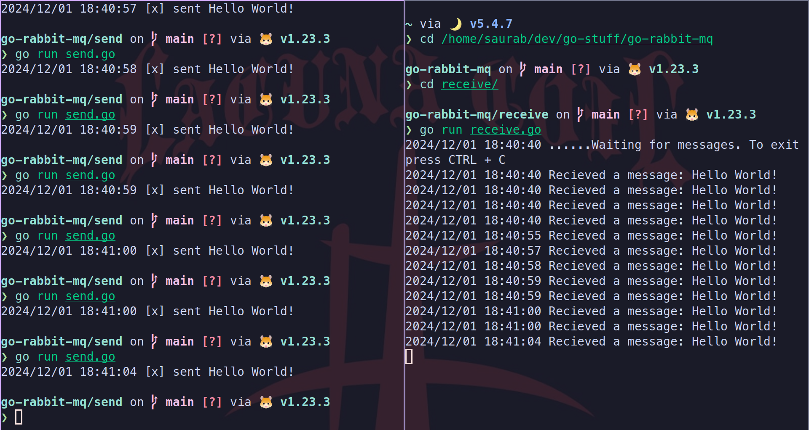

# Rabbit MQ Simple Implementation

## Usage 

```bash
docker-compose up -d
cd sender
#sends a hello world message
go run sender.go 

cd receiver
#receives the message
go run receiver.go
```

Haha latency is like almost negligible. You can't blink your eyes faster than a rabbit.

